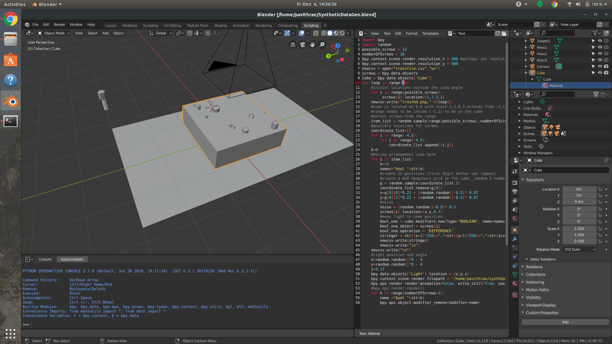
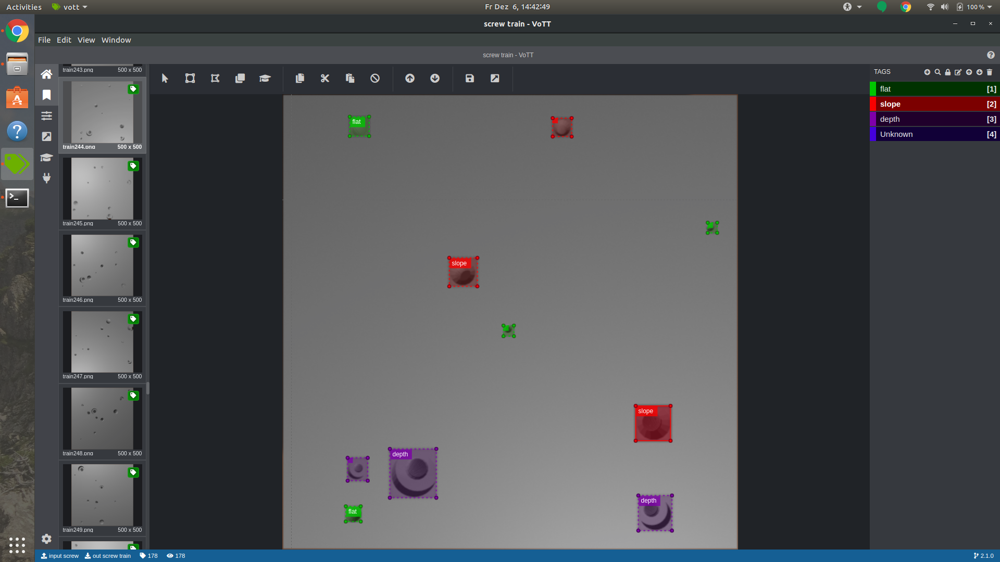
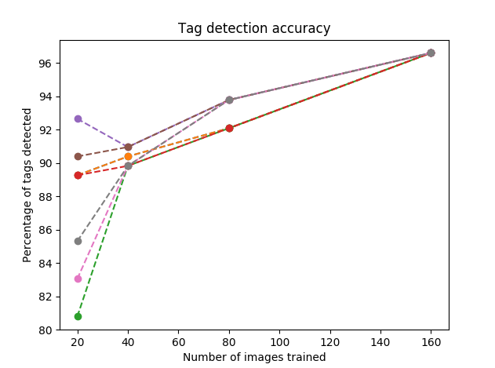
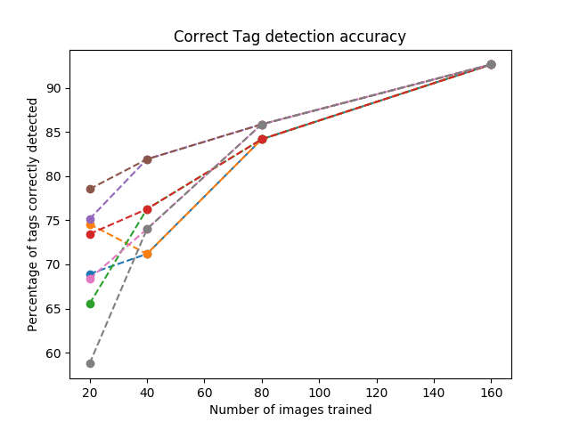

# Active Learning Evaluation
Fraunhofer IPA Project

Evaluation of active learning pipeline:

The project aims to evaluate a process to reduce manual labelling effort by active learning.

Process involves:
  1. Label a small set of train data.
  2. Train the model on the labelled data.
  3. Use the model to make predictions on some more data.
  4. Use manual labelling, if the model misses finding some labels.
  5. continue from step 2, gradually increasing the model accuracy.

To start with Synthetic Data was produced using Blender. It was partitioned into train, test sets.

  The data consists of images with randomly positioned screw holes, with varying light conditions, controlled in the blender environment.
  A sample:
  
  
VOTT was used for labelling the data set, It was chasen as it had features to integrate custom models for active learning.
InceptionV2 model was used for object detection. Active learning used the following process to get the model trained and compatible with VOTT.
  
1.A pretrained InceptionV2 model was used.
2.After every small set was labelled, the model was trained on it.
3.The model weights were saved from the last check point.
4.The saved model was converted to tensorflowjs model, with was compatible with VOTT. 

The data produced was labelled and evaluated cummulatively and the preformance of the model was plotted as shown below

